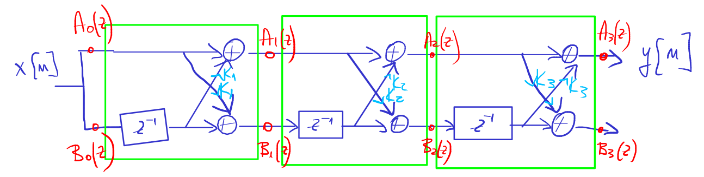
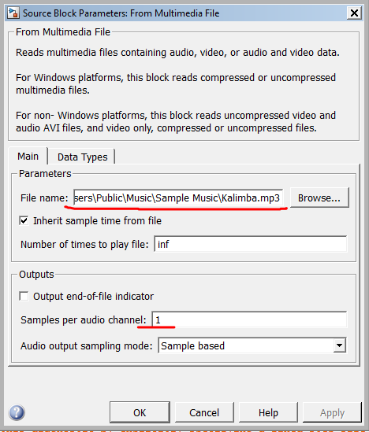
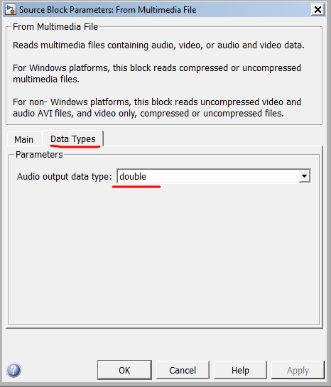
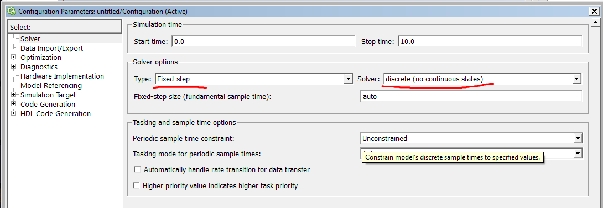

# Obiectiv

Familiarizarea studenților cu formele de implementare tip *lattice* folosite
la implementarea filtrelor de tip FIR

# Noțiuni teoretice

Implementarea în formă *lattice* a unui filtru FIR de ordin 3:

Ecuații:

$$\begin{aligned}
A_0(z) &= B_0(z) = 1 \\
A_m(z) &= A_{m-1}(z) + K_m \cdot z^{-1} \cdot B_{m-1}(z) \\
A_{m-1}(z) &= \frac{A_m(z) - K_m  \cdot B_m(z)}{1 - K_m^2} \\
B_m(z) &= z^{-m} B_m(z^{-1}) = \textrm{ similar cu }A_m(z)\textrm{, cu coeficienții în ordine inversă}
\end{aligned}$$

Aceste ecuații permit calcularea coeficienților de reflexie $K_m$ din $H(z)$,
sau calcularea $H(z)$ dacă se cunosc $K_m$.

# Exerciții

1. Determinați coeficienții filtrului FIR în forma directă
dacă se cunosc coeficienții de reflexie ai structurii *lattice*:
$K_1 = \frac{1}{2}$, $K_2 = 0.6$, $K_3 = -0,7$, $K_1 = \frac{1}{3}$.

2. Determinați coeficienții structurii *lattice* pentru un filtru FIR cu funcția de sistem:
$$H(z) = 1 + \frac{2}{5}z^{-1} + \frac{7}{20}z^{-2} + \frac{1}{2}z^{-3}$$

4. Utilizați utilitarul `fdatool` pentru a proiecta unul din filtrele următoare:
    
    a. Un filtru trece-jos FIR de ordin 5, de tip echiriplu, cu frecvența de tăiere de 5kHz la o frecvență de eșantionare de 44.1kHz;
    a. Un filtru trece-sus FIR de ordin 5, de tip echiriplu, cu frecvența de tăiere de 1kHz la o frecvență de eșantionare de 44.1kHz;
    a. Un filtru trece-bandă FIR de ordin 5, de tip echiriplu, cu banda de trecere între 700Hz si 4kHz la o frecvență de eșantionare de 44.1kHz.

4. În mediul Simulink, realizați implementarea FIR filtrului de mai sus în forma *lattice*.

Observații:

- Veți avea nevoie de blocurile *Unit Delay*, *Sum* și *Gain*
- La intrare puneți un bloc *From Multimedia File*, la ieșire un bloc *To Audio Device*
- La ieșire, înainte de blocul *To Audio Device* intercalați un bloc *Manual Switch* la care semnalul original și semnalul filtrat, pentru a putea comuta ușor între cele două
- La blocul *From Multimedia File* selectați un fișier audio (de ex. Kalimba.mp3
din My Documents) și puneți setările *Sample-based*, *Samples per audio channel* = 1 
și "DataTypes/Audio output data type" = *double*

{width=50%}
{width=50%}

- Setați parametrii modelului Simulink pentru o simulare discretă, cu pas fix (auto):
    - Type: *Fixed-step*
    - Solver: *discrete (no continuous states)*
    

# Întrebări finale

1. TBD
