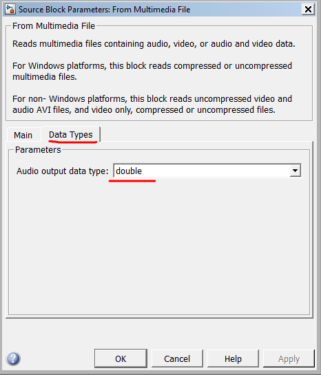

# Obiectiv

Familiarizarea studenților cu formele de implementare tip *lattice* pentru filtre IIR

# Noțiuni teoretice

Implementarea în formă *lattice-ladder* a unui filtru IIR de ordin 3:

Ecuații:

$$\begin{aligned}
H(z) &= \frac{C(z)}{A(z)}
\end{aligned}$$

Coeficienții de reflexie $K_i$ se găsesc exact ca la sistemele FIR (lab. precedent):
$$\begin{aligned}
A_0(z) &= B_0(z) = 1 \\
A_m(z) &= A_{m-1}(z) + K_m \cdot z^{-1} \cdot B_{m-1}(z) \\
A_{m-1}(z) &= \frac{A_m(z) - K_m  \cdot B_m(z)}{1 - K_m^2} \\
B_m(z) &= z^{-m} B_m(z^{-1}) = \textrm{ similar cu }A_m(z)\textrm{, cu coeficienții în ordine inversă}
\end{aligned}$$

Suplimentar, pentru coeficienții $\nu_i$ se folosește o ecuație asemănătoare:
$$\begin{aligned}
C_{m-1}(z) &= C_m(z) - \nu_m  \cdot B_m(z)
\end{aligned}$$

# Exerciții

1. Fie sistemul IIR cauzal cu poli și zerouri, cu funcția de sistem:
$$H(z) = \frac{ 1 + 2z^{-1} + 3z^{-2} + 2z^{-3} }{ 1 + \frac{2}{5}z^{-1} + \frac{7}{20}z^{-2} + \frac{1}{2}z^{-3} } $$

	Determinați și desenați structura echivalentă *lattice* cu poli și zerouri.

2. Se dă sistemul IIR cauzal numai cu poli, cu funcția de sistem:
$$H(z) = \frac{1}{ 1 + \frac{2}{5}z^{-1} + \frac{7}{20}z^{-2} + \frac{1}{2}z^{-3} } $$
	
	Determinați coeficienții structurii *lattice* și desenați-o.

	
3. Utilizați utilitarul `fdatool` pentru a proiecta unul din filtrele următoare:
    
    a. Un filtru trece-jos IIR de ordin 4, de tip eliptic, cu frecvența de tăiere de 5kHz la o frecvență de eșantionare de 44.1kHz;
    a. Un filtru trece-sus IIR de ordin 4, de tip eliptic, cu frecvența de tăiere de 1kHz la o frecvență de eșantionare de 44.1kHz;
    a. Un filtru trece-bandă IIR de ordin 4, de tip eliptic, cu banda de trecere între 700Hz si 4kHz la o frecvență de eșantionare de 44.1kHz.

4. Exportați coeficienții în Matlab și convertiți-i la forma *lattice* cu funcția `tf2latc()`
	
5. În mediul Simulink, realizați implementarea IIR filtrului de mai sus în forma *lattice*. 
Ascultați efectul filtrului asupra unui semnal audio. Afisați semnalul de ieșire cu blocul `Scope`.

5. În mediul Simulink, aplicați la intrarea sistemului o secvență video (selectați un fișier video
în blocul `From Multimedia File`). Puneți la ieșire un bloc `Video Viewer` în locul ieșirilor audio.
Cum arată semnalul filtrat? Ce se observă?

Observații:

- Veți avea nevoie de blocurile *Unit Delay*, *Sum* și *Gain*
- La intrare puneți un bloc *From Multimedia File*, la ieșire un bloc *Buffer* urmat de *Audio Device Writer*
- La ieșire, înainte de blocul *To Audio Device* intercalați un bloc *Manual Switch* la care semnalul original și semnalul filtrat, pentru a putea comuta ușor între cele două
- La blocul *From Multimedia File* selectați un fișier audio (de ex. `Kalimba.mp3` din My Documents) și puneți setările *Sample-based*, *Samples per audio channel* = 1 
și "DataTypes/Audio output data type" = *double*

{width=50%}
{width=50%}

# Întrebări finale

1. TBD
